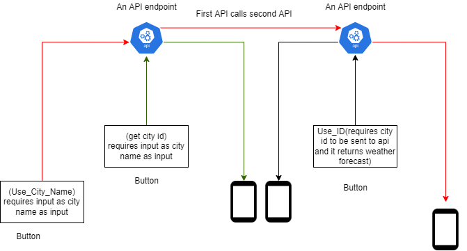
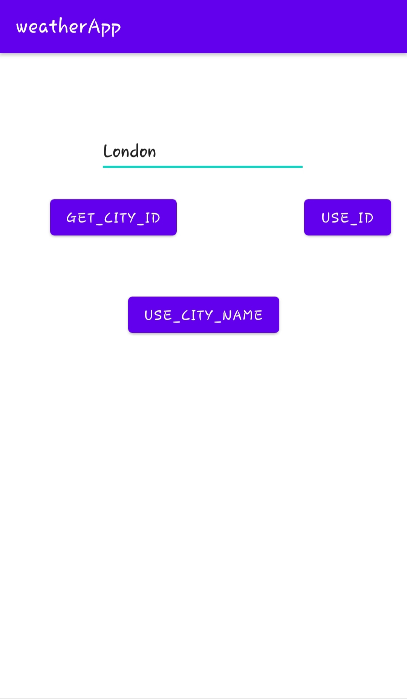
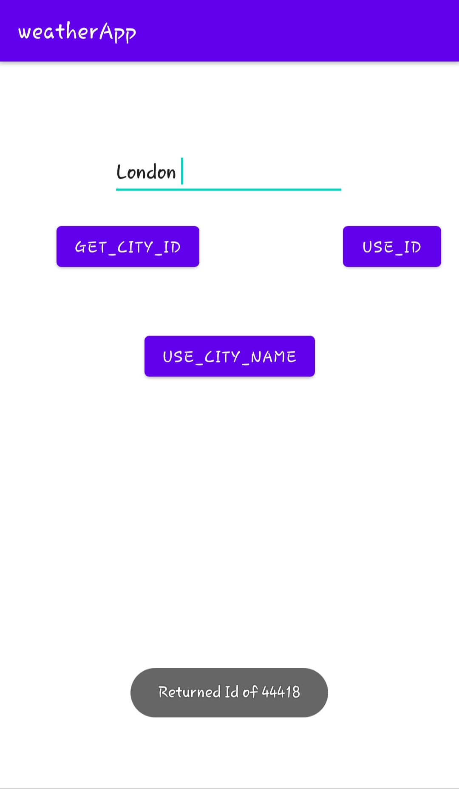

# WeatherApp
Uses metaweather's API.

# layout 
1. Its haivng a simple layout consisting of three buttons, which are used to call different API endpoints.
2. There is also a ListView to show the data.

<table>
  <tr>
    <td>UI</td>
    
    
  </tr>
  <tr>
    <td></td>
    
  </tr>
 </table>

  
  
  

<table>
  <tr>
    <td>GettingCityID</td>
     <td>GotCityID</td>
     <td>UsingCityID</td>
  </tr>
  <tr>
    <td></td>
    <td></td>
    <td></td>
  </tr>
 </table>

  

  
  

<table>
  <tr>
    <td>UsingCityName</td>
   
     
  </tr>
  <tr>
    <td>
  
   </td>
  
   
  </tr>
 </table>

  

  
  

