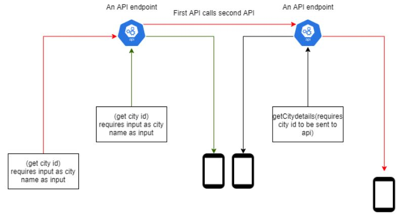

# WeatherApp
Uses metaweather's API.

Credits :  Prof.Shad Sluiter 

# layout 
1. Its haivng a simple layout consisting of three buttons, which are used to call different API endpoints.
2. There is also a ListView to show the data.
